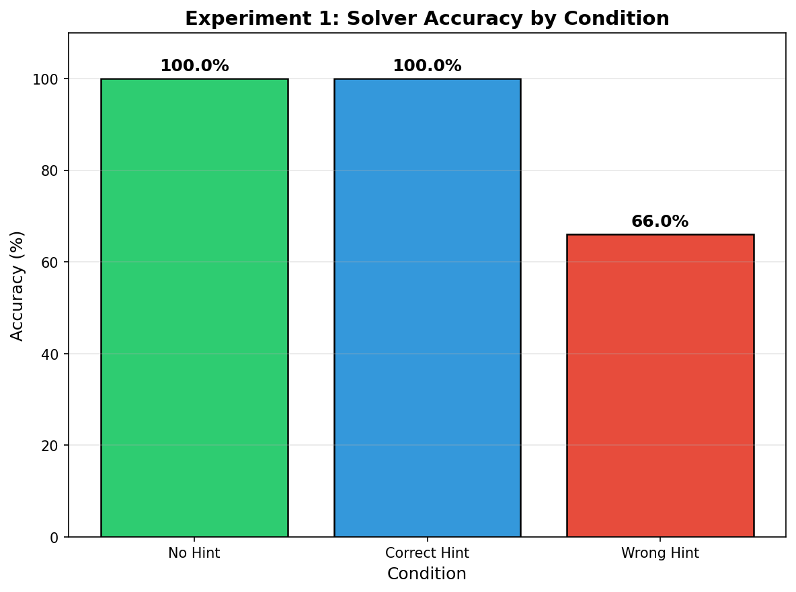
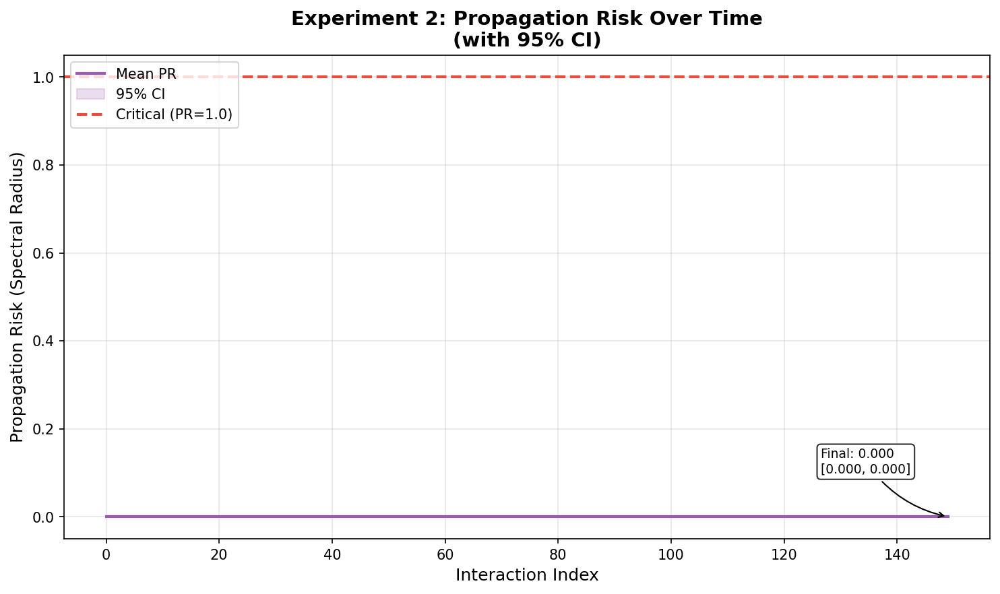
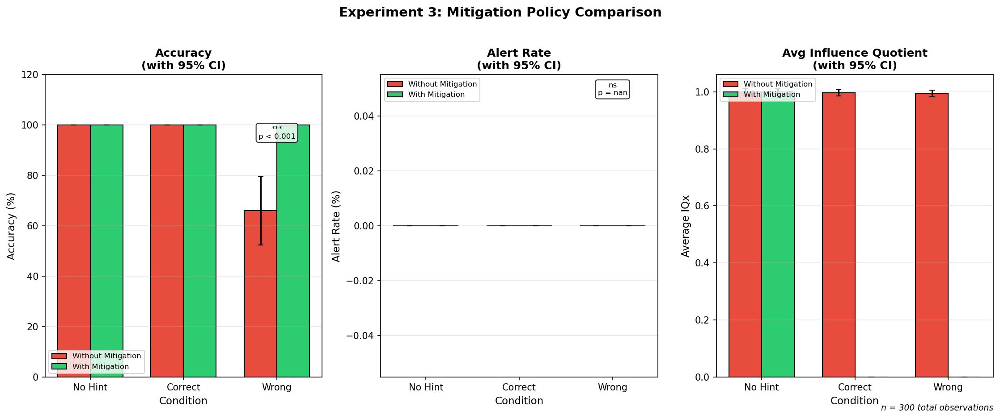

# TraceIQ

Measure AI-to-AI influence in multi-agent systems.

[](https://pypi.org/project/traceiq/)
[](https://pypi.org/project/traceiq/)
[](https://pypi.org/project/traceiq/)

---

## Quickstart

```python
from traceiq import InfluenceTracker

tracker = InfluenceTracker(use_mock_embedder=True)

result = tracker.track_event(
    sender_id="agent_a",
    receiver_id="agent_b",
    sender_content="We should switch to renewable energy.",
    receiver_content="Good point. Renewables are the future.",
)

print(f"Drift: {result['drift_l2_state']}")
print(f"IQx: {result['IQx']}")
print(f"Alert: {result['alert']}")

tracker.close()
```

---

## What TraceIQ Is

- Tracks how AI agent outputs change after receiving messages from other agents
- Computes influence metrics based on semantic embedding similarity
- Provides anomaly detection via Z-score thresholds
- Builds influence graphs for network-level analysis
- Includes reproducible research experiments

## What TraceIQ Is NOT

- **Not causal inference**: Metrics show correlation, not proven causation
- **Not intent detection**: Cannot determine if influence is intentional
- **Not content analysis**: Measures embedding similarity, not semantic meaning
- **Not internal state tracking**: Only observes agent outputs, not cognition
- **Not a security solution**: Research tool, not production security system
- **Thresholds require calibration**: Default values need tuning per environment

---

## Installation

```bash
# Core (lightweight, no ML dependencies)
pip install traceiq

# With sentence-transformers for real embeddings
pip install "traceiq[embedding]"

# With pandas/scipy/matplotlib for research
pip install "traceiq[research]"
```

---

## Example Results

These plots are generated by the included experiments (`experiments/plot_all.py`):

### Experiment 1: Wrong Hint Detection

Compares solver accuracy and TraceIQ alerts across baseline, correct hint, and wrong hint conditions.



### Experiment 2: Propagation Risk Over Time

Tracks spectral radius as influence spreads through a chain of agents.



### Experiment 3: Mitigation Effectiveness

Compares accuracy with and without a mitigation guard that quarantines suspicious interactions.



---

## Integration Patterns

TraceIQ works with various agent architectures. See [docs/integration.md](docs/integration.md) for templates:

| Pattern | Description |
|---------|-------------|
| LLM-only | Basic tracking of message/response pairs |
| RAG | Include retrieved chunks in `receiver_input_view` |
| Tool-using | Log tool outputs for context |
| Memory agents | Track before/after memory state |
| Multi-agent orchestrator | Full conversation flow tracking |

---

## Research Context

TraceIQ is developed for research on AI-to-AI influence in multi-agent systems. The metrics (IQx, RWI, Z-score, Propagation Risk) are project-defined research metrics documented in this repository. They are not externally standardized. Mathematical foundations and proofs are in [docs/THEORY.md](docs/THEORY.md).

---

## Documentation

| Document | Description |
|----------|-------------|
| [docs/metrics.md](docs/metrics.md) | Metric definitions and formulas |
| [docs/integration.md](docs/integration.md) | Integration patterns |
| [docs/cli.md](docs/cli.md) | CLI reference |
| [docs/configuration.md](docs/configuration.md) | TrackerConfig options |
| [docs/architecture.md](docs/architecture.md) | System architecture |
| [docs/THEORY.md](docs/THEORY.md) | Mathematical foundations |
| [experiments/README.md](experiments/README.md) | Research testbed |

**CLI help:** `traceiq --help`

**PyPI:** [pypi.org/project/traceiq](https://pypi.org/project/traceiq/)

---

## Usage Assumptions

For reliable metrics:

- **Log receiver context**: For RAG/tools, provide `receiver_input_view`
- **Check validity before alerting**: Use `result["valid"]` to avoid cold-start noise
- **Calibrate thresholds**: Default values (Z > 2.0, etc.) need tuning per environment
- **Interpret PR carefully**: Propagation Risk is a relative indicator; establish baseline values for your system

---

## Releasing TraceIQ

To release a new version:

1. Update version in `pyproject.toml`
2. Commit the change:
   ```bash
   git add pyproject.toml
   git commit -m "chore: bump version to X.Y.Z"
   ```
3. Create and push the tag:
   ```bash
   git tag vX.Y.Z
   git push origin vX.Y.Z
   ```
4. GitHub Actions automatically:
   - Runs full test suite
   - Builds the package
   - Publishes to PyPI
   - Creates GitHub Release

For release candidates, use tags like `v0.4.0rc1` (published to TestPyPI).

---

## License

MIT License - see [LICENSE](LICENSE) for details.

## Contributing

Contributions welcome. See [CONTRIBUTING.md](CONTRIBUTING.md) or:

1. Fork the repository
2. Create a feature branch
3. Run tests (`pytest`) and linter (`ruff check src/ tests/`)
4. Submit a Pull Request

## Citation

```bibtex
@software{traceiq,
  title = {TraceIQ: Measure AI-to-AI Influence in Multi-Agent Systems},
  year = {2026},
  url = {https://github.com/Anarv2104/TraceIQ}
}
```
